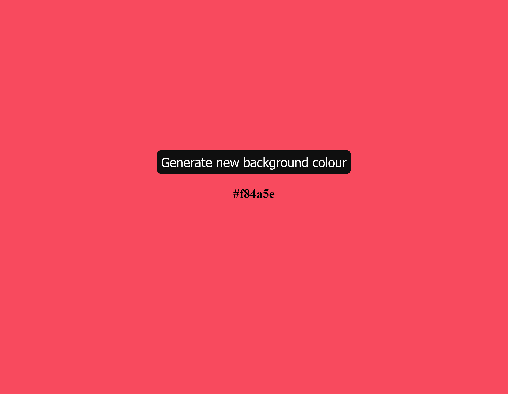

# js-change-background-colour-hex
JS Challenge 2

Exercise 2 from the 100+ Javascript projects page (https://jsbeginners.com/javascript-projects-for-beginners/)

This code creates a random HEX background colour when clicking a button.

